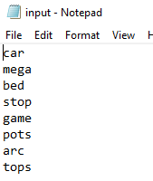
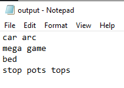
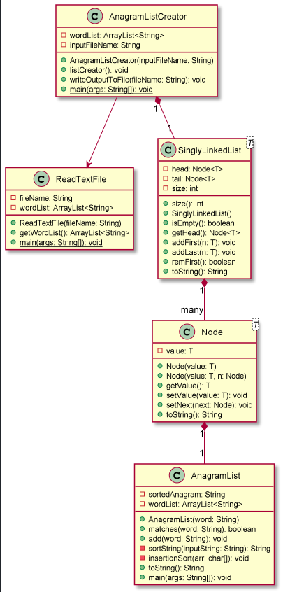

#ENSF 594 - A3: Anagram List Creator
The goal of this assignment is to write a Java program 
that arranges a list of words into separate lists of anagrams. <br>
**To execute this program:** use ```main()``` method in ```AnagramListCreator``` class


## Example Input and Output
* Example Input: <br>
  <br>
* Example Output <br>
  <br>

##UML Diagram/Program Description
<br>
* My program is executed by running the main method within the ```AnagramListCreator``` Class.
* The ```ReadTextFile``` class is used to read the input text file, and return an array
of strings which will be used in the program.
* The ```AnagramListCreator``` class fulfills the objective of this assigment, by creating
a Singly Linked List, where each node contains a list of anagrams.
* The ```SinglyLinkedList``` class and ```Node``` class are adapted from the class notes.
Both of them require the user to specify a generic type, of which the list/nodes will contain.
In this case, the generic type is an AnagramList, which is a custom class I made to hold the
list of anagrams. 
* The ```AnagramList``` class is essentially an ArrayList, but with added features. As the name suggests, it holds one list of
  Anagrams. Ex, one anagram list could contain "arc, car". The key features include:
    * ```sortedAnagram``` field: when the Anagram List is first created, this field is added. The sortedAnagram
    field is used when determining if another word is an anagram we can add to the list.
  * ```matches()``` method: this takes a word, and determines if it is an anagram that can be added to the list. 

##General Logic for creating the output
1. Obtain array of words to be analyzed
2. For each word in array:
    1. Traverse through the linked list which holds our AnagramLists
        1. If the word can be added as an anagram to one of the existing lists, do this
        2. otherwise, create a new node, with a new AnagramList, using this word
3. Write the output to a text file.

